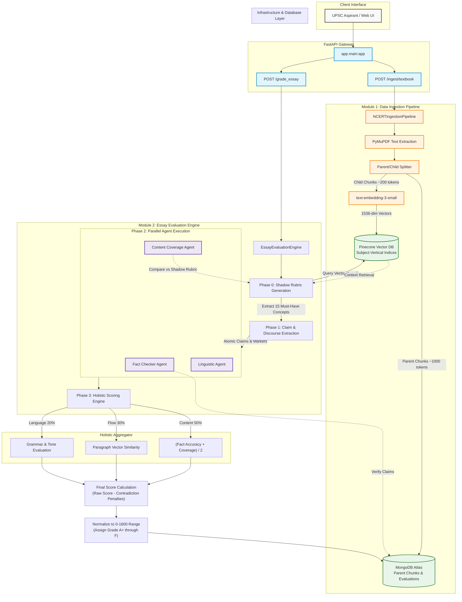

# Essay Grader Portfolio Project

A concise, architecture-first AI essay grading platform for UPSC aspirants that combines OCR ingestion, vector search, and a multi-agent evaluation pipeline.

## Core Features

- **Grammar Analysis**: Detects spelling, punctuation, and sentence-level fluency to improve readability.
- **Fact Checking**: Validates essay claims against ingested NCERT content and trusted textbook knowledge.
- **Holistic Scoring**: Computes a balanced score from content accuracy, flow, and language quality.
- **Concept Coverage**: Measures whether the essay includes the most important concepts for the topic.
- **Textbook Ingestion**: Converts NCERT PDFs into searchable knowledge stores with parent-child chunking.
- **Parallel Evaluation**: Runs fact, content, and linguistic agents concurrently for faster grading.
- **Scalable Pipeline**: Uses Kafka for async processing, batching, and worker orchestration.

## What This Project Solves

This system is built to grade essays beyond surface-level style checks. It evaluates work across four frontiers:

1. **Grammar** – correct language, sentence structure, and tone.
2. **Fact-checking** – accuracy of claims against textbook evidence.
3. **Holistic approach** – how ideas are organized, connected, and scored in aggregate.
4. **Concepts-covered** – whether key topic concepts appear clearly and correctly.

## Architecture Summary

- **Client** submits an essay or textbook ingestion request.
- **FastAPI** routes requests and produces Kafka jobs.
- **OCR Worker** extracts text and stores parent chunks in MongoDB.
- **Vector pipeline** embeds child chunks for semantic search in Pinecone.
- **Essay Evaluation Engine** queries the knowledge store, generates a shadow rubric, and runs parallel agents.
- **Scoring Engine** aggregates content, flow, and language into a normalized final grade.

## Data Flow Diagram

## Technical Design Highlights

### Textbook storage scaling

- **Parent/child chunking** stores textbooks as a hierarchical knowledge graph.
- **Parent chunks** hold broader context (~1000 tokens) for semantic alignment.
- **Child chunks** are narrow, dense pieces (~200 tokens) optimized for embedding.
- This model prevents oversized text blocks and keeps retrieval efficient even for large NCERT books.
- **MongoDB** stores raw parent chunks and evaluation metadata, while **Pinecone** stores vector embeddings for fast semantic lookups.

### Parallel users and throughput

- **Kafka streaming** decouples the API gateway from OCR and AI workers.
- Requests are queued into topics so the backend never blocks while waiting for expensive processing.
- **Workers** consume and process jobs concurrently, enabling many users to submit essays at once.
- **Batching** and rate limiting mitigate API and model throttling while maximizing throughput.
- A streaming design also supports replay, backpressure, and fault-tolerant retries.

### Solution-architecture

- **Async pipeline** was chosen so grading can scale independently from request ingress.
- **Separate storage tiers** preserve transactional metadata in PostgreSQL, raw content in MongoDB, and semantic state in Pinecone.
- **Multi-agent evaluation** isolates fact validation, content coverage, and linguistic quality for explainable scoring.
- **Holistic scoring** combines multiple signals instead of relying on a single model output, reducing bias and improving consistency.
- **Contrast penalties** ensure contradictory or unsupported claims lower the final score.

## Why these four grading frontiers matter

- **Grammar** ensures that the essay is readable and professionally presented.
- **Fact-checking** verifies that the essay is not just plausible but also grounded in textbook evidence.
- **Holistic approach** evaluates structure, argument coherence, and idea progression.
- **Concepts-covered** ensures students address the right syllabus nodes and key topic facts.

## Quick usage notes

- `POST /ingest/textbook` loads NCERT content and prepares the knowledge store.
- `POST /grade_essay` evaluates a candidate essay using shadow rubrics and parallel agents.
- Grades normalize into a 0–1600 range with letter grades from A+ to F.

### Kafka Connection Issues
- Ensure `KAFKA_BOOTSTRAP_SERVERS` is set correctly
- For Docker: use `kafka:9092` (internal)
- For local: use `localhost:9092`

### OCR Not Working
- Install Tesseract: `apt-get install tesseract-ocr`
- Currently using mock OCR for demo

### MongoDB Connection
- Check MongoDB is running: `docker ps | grep mongo`
- Verify connection string in `.env`

## Future Enhancements

- [ ] S3 file storage instead of inline hex
- [ ] Email notifications
- [ ] User authentication
- [ ] Advanced grading rubrics
- [ ] Multiple AI models support
- [ ] Result caching

## License

MIT

## Support

For issues, create a GitHub issue or contact the maintainer.
